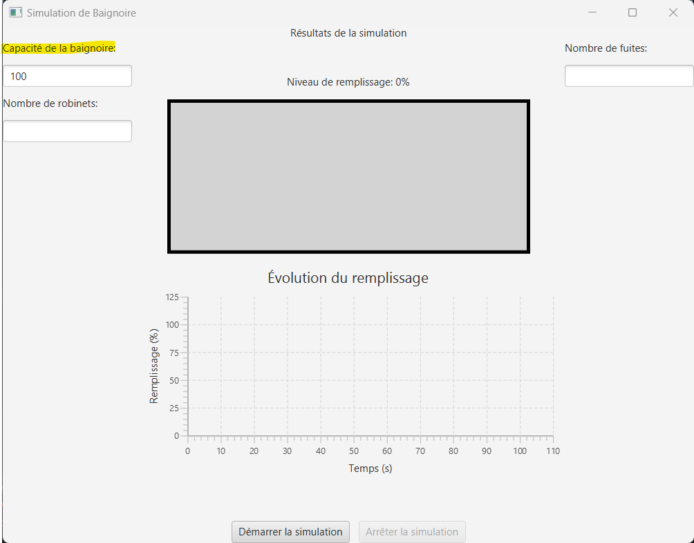
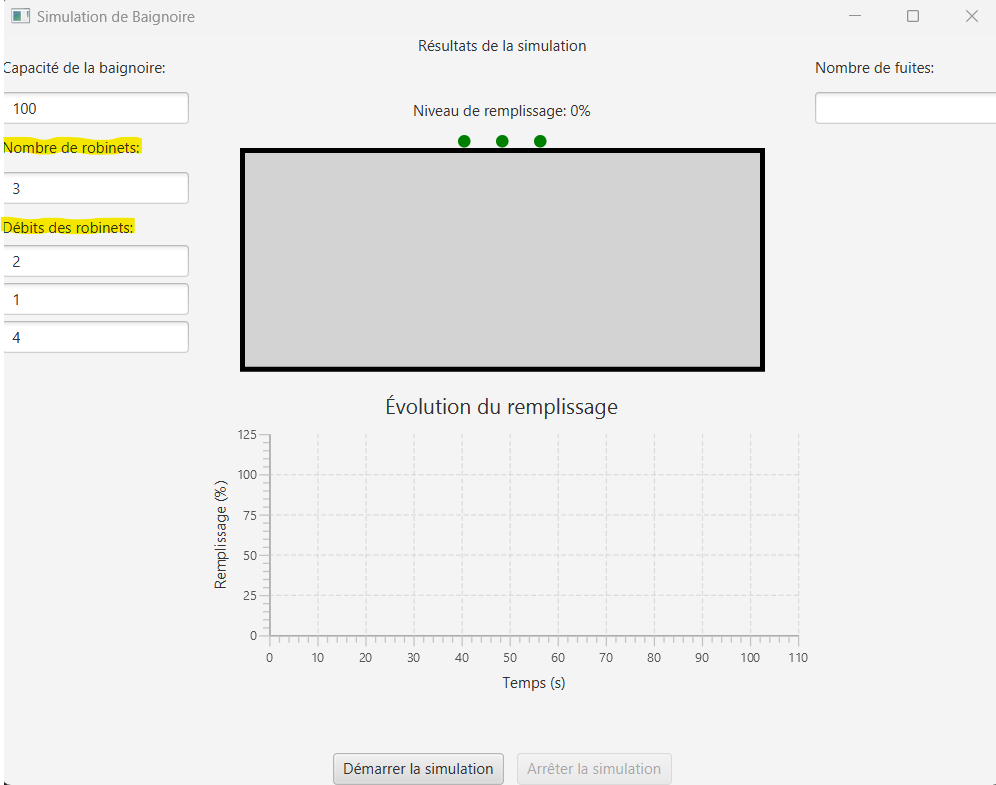
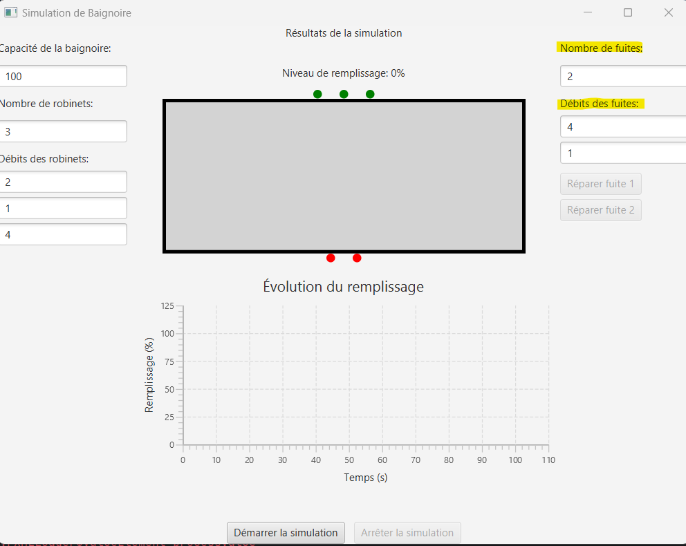
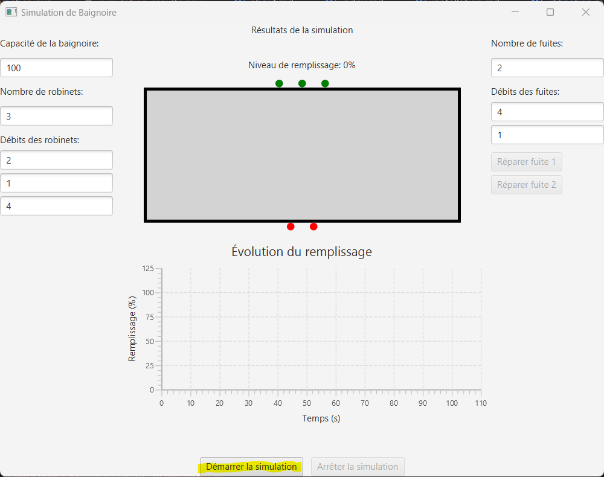
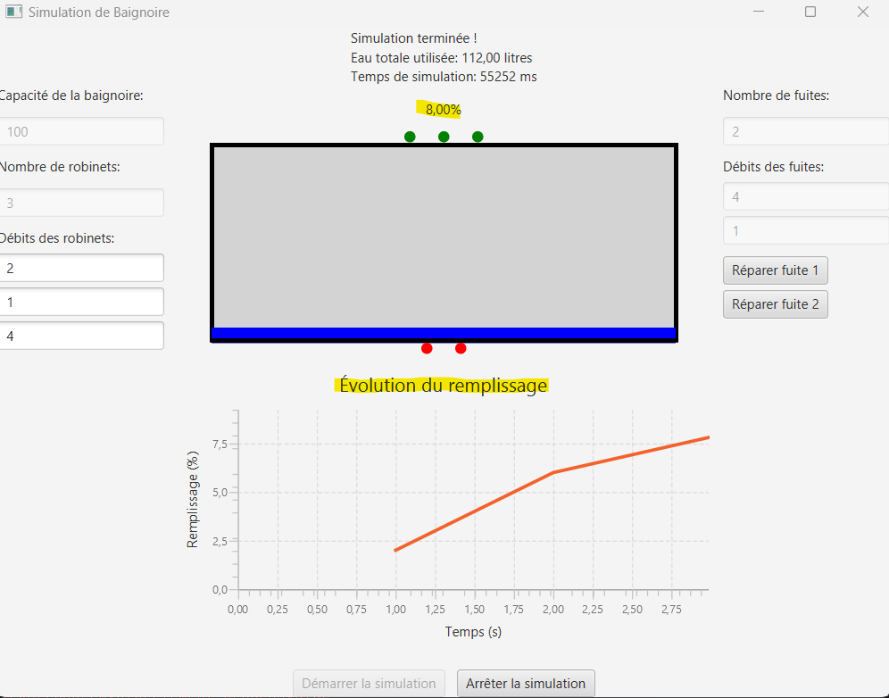
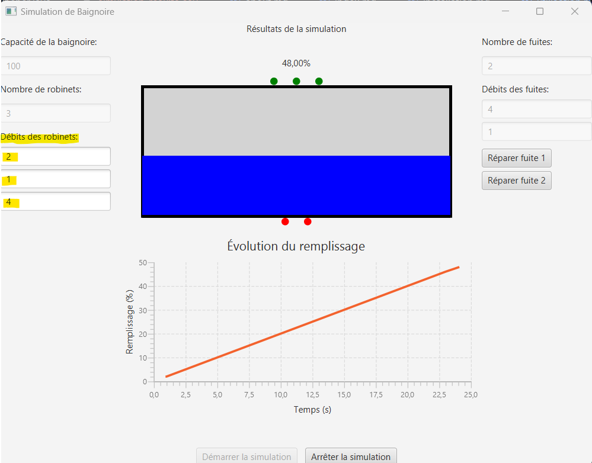
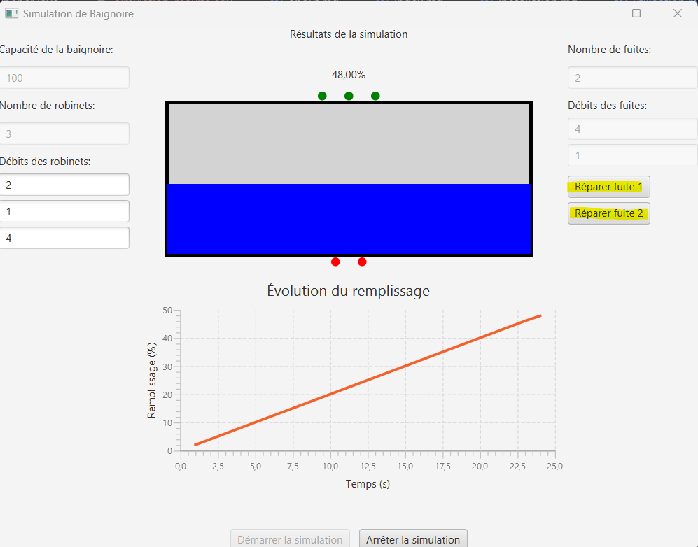
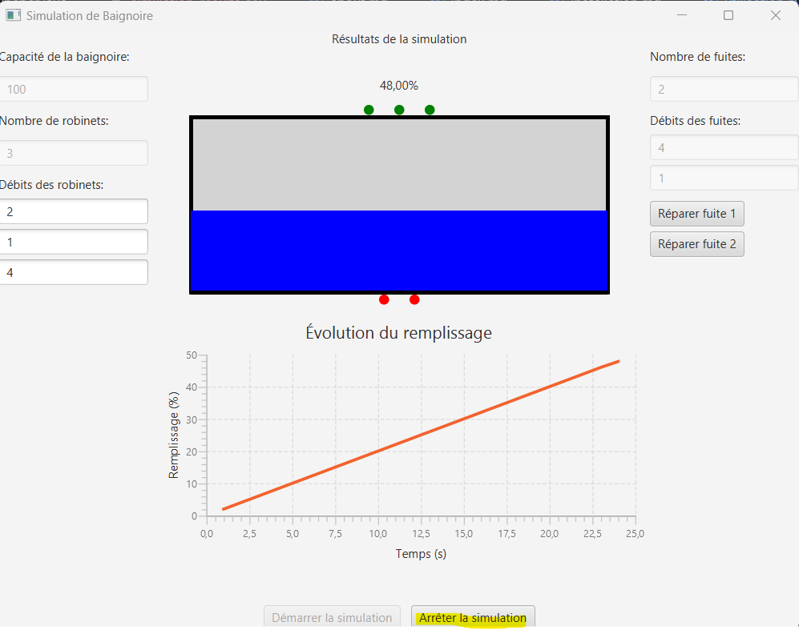
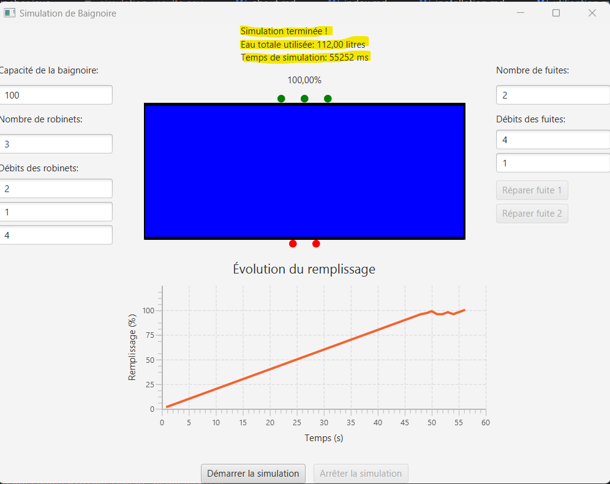

# Utilisation

Ce guide explique comment utiliser l'application.

## Lancer l'application

1. Exécutez la classe `fr.ul.miage.Launcher` depuis votre IDE.
2. L'interface utilisateur s'ouvrira avec des champs de saisie pour la capacité de la baignoire, le nombre de robinets et le nombre de fuites.

## Paramètres de simulation

### Capacité de la baignoire

- Entrez la capacité de la baignoire en litres.

### Robinets

1. Entrez le nombre de robinets.
2. Pour chaque robinet, spécifiez le débit en litres par seconde.

### Fuites

1. Entrez le nombre de fuites.
2. Pour chaque fuite, spécifiez le débit en litres par seconde.

## Démarrer la simulation

- Cliquez sur le bouton "Démarrer la simulation" pour commencer le remplissage de la baignoire.

##
- Vous pouvez observer le niveau de remplissage en temps réel en visualisant la baignoire ainsi que la courbe de remplissage en temps réel dans l'interface.

## Augmenter les débits des robinets

- Pendant la simulation vous pouvez augmenter ou diminuer le débit d'un ou des robinets que vous souhaitez.

## Réparer les fuites

- Si des fuites sont présentes, vous pouvez les réparer en cliquant sur les boutons correspondants.

## Arrêter la simulation

- Cliquez sur le bouton "Arrêter la simulation" pour arrêter le remplissage.

## Résultats de la simulation

- Après l'arrêt de la simulation, les résultats s'afficheront en haut de l'interface, indiquant l'eau totale utilisée et le temps de simulation.

###
- Un fichier CSV sera généré à l'issu de la simulation afin de pouvoir générer une courbe de remplissage.

